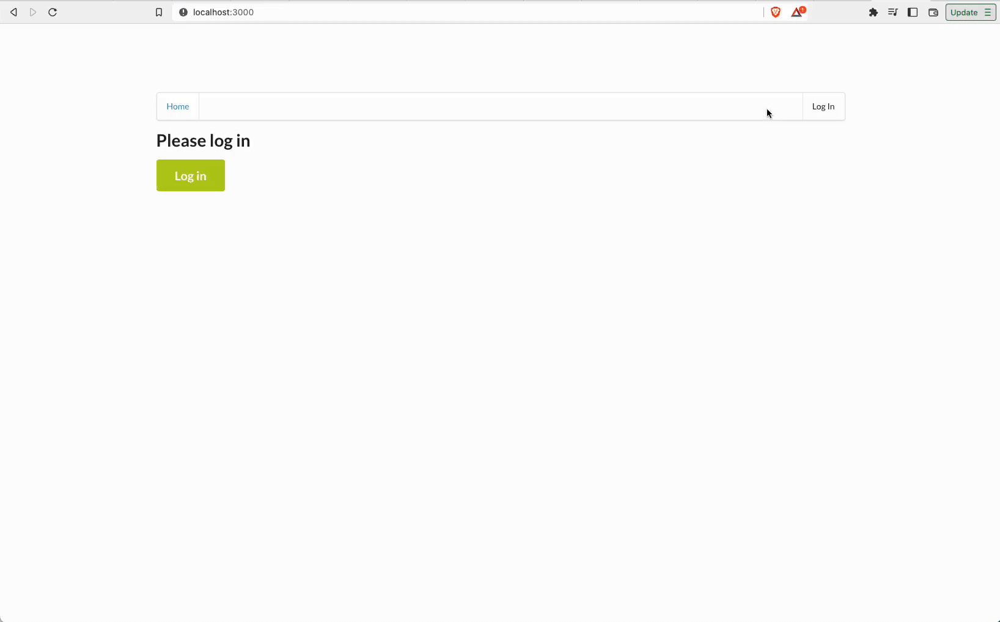

# Serverless Todo App

## App demo



# How to run the application?

## Backend

To deploy an application run the following commands:

```
cd backend
npm install
sls deploy -v
```

## Client

To run a client application with your desired parameters, edit the client/src/config.ts file to set correct parameters. And then run the following commands:

```
cd client
npm install
npm run start
```

This should start a development server with the React application that will interact with the Serverless Todo App
